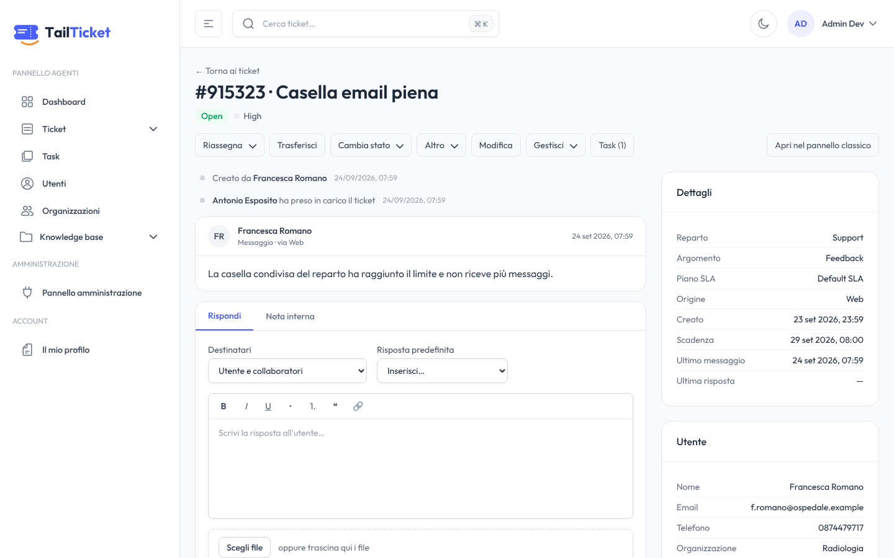
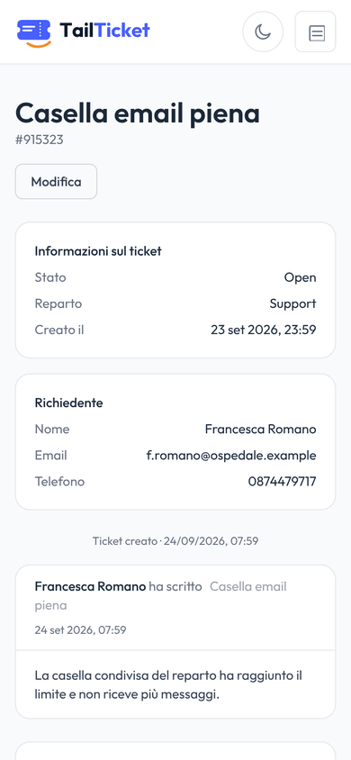

<p align="center">
  
</p>

<p align="center">
  <strong>L'helpdesk moderno, compatibile con osTicket.</strong><br>
  Una nuova interfaccia per osTicket, sullo stesso database, senza migrazioni.
</p>

<p align="center">
  <a href="docs/philosophy.md">Filosofia</a> ·
  <a href="docs/scope.md">Scope</a> ·
  <a href="deploy/README.md">Deploy</a> ·
  <a href="docs/compatibility.md">Compatibilità</a> ·
  <a href="docs/README.md">Documentazione</a> ·
  <a href="docs/index.html">Presentazione</a>
</p>

---

> **In short (EN)** — TailTicket is a fork of [osTicket](https://osticket.com) 1.18 that gives it a modern, responsive web interface (Next.js + Tailwind) while keeping the **same MySQL database**. Every write reproduces exactly the rows (and emails) the PHP code would produce, verified by 300+ differential tests, so the classic osTicket panel keeps working side by side and future osTicket upgrades remain possible. One command deploys the whole stack with Docker.

## Perché

osTicket è un helpdesk solido: open source, in produzione da quasi vent'anni in migliaia di organizzazioni. Ha email in ingresso, SLA, code, form dinamici e un modello dati maturo.

L'interfaccia però è rimasta indietro:
- pagine PHP renderizzate lato server con jQuery;
- poco usabile da smartphone;
- difficile da brandizzare;
- lontana da ciò che agenti e clienti si aspettano oggi.

Riscrivere un helpdesk da zero significa buttare via anni di comportamenti consolidati e affrontare migrazioni rischiose. Restare su osTicket così com'è significa accettare un'esperienza datata.

## La soluzione

TailTicket tiene il **cuore** di osTicket e rifà la **faccia**:

| | osTicket classico | TailTicket |
|---|---|---|
| Database | MySQL/MariaDB osTicket | **lo stesso**, senza tabelle nuove né migrazioni |
| Logica di dominio | PHP (`legacy/`) | porting TypeScript riga per riga, verificato contro il PHP |
| Interfaccia | PHP + jQuery | Next.js 16, React 19, Tailwind v4: responsive, tema chiaro/scuro, brandizzabile |
| Pannello agenti, admin, portale clienti | ✅ | ✅ riscritti |
| Cron, fetch email, API REST, plugin | ✅ | restano a osTicket, che continua a girare accanto |

Le due interfacce lavorano **in contemporanea sugli stessi dati**. Si può adottare TailTicket gradualmente, tornare indietro in qualsiasi momento e continuare ad applicare gli aggiornamenti di osTicket.

Come facciamo a fidarci? Ogni operazione di scrittura (risposta, assegnazione, creazione ticket, impostazioni admin…) è coperta da **test differenziali**:
1. la stessa operazione viene eseguita dal codice PHP originale e da TailTicket, su due copie del DB;
2. si confrontano **tutte le tabelle e le email** generate.

Oggi i test sono **351 scenari**, tutti identici. Dettagli in [docs/compatibility.md](docs/compatibility.md).

## Cosa c'è dentro

- **Pannello agenti**:
  - code e ricerca;
  - vista ticket con risposta, note e allegati;
  - assegnazioni, trasferimenti, referral, merge/link, azioni di massa, export CSV;
  - task, utenti e organizzazioni, KB, profilo con 2FA.
- **Area amministrazione**:
  - impostazioni, reparti, help topic, SLA, orari, agenti, team, ruoli;
  - email, template, filtri, form, liste, pagine, code, chiavi API, log, plugin;
  - tema e brand.
- **Portale clienti**:
  - login, registrazione e accesso ospite;
  - i miei ticket, apertura ticket con form dinamici, KB pubblica;
  - responsive per l'uso da telefono.
- **Deploy in un comando**: Docker Compose con TailTicket, osTicket classico (con cron), MariaDB e reverse proxy con HTTPS automatico.

Elenco completo e limiti noti in [docs/scope.md](docs/scope.md).

<!-- screenshot: generati in docs/assets/screenshots/ -->
<p align="center">
  
  
</p>

## Avvio rapido

```bash
git clone https://github.com/paolo-trivi/tailticket tailticket
cd tailticket/deploy
./tailticket up
```

Il comando:
1. genera i segreti;
2. costruisce le immagini;
3. installa osTicket nel database, se è vuoto;
4. stampa gli indirizzi e le credenziali iniziali.

Per collegarsi a un osTicket già in produzione, HTTPS, email e backup: [deploy/README.md](deploy/README.md).

Per sviluppare: [docs/development.md](docs/development.md).

## Struttura del repository

```
├── apps/web/      TailTicket: app Next.js (pannello agenti, admin, portale clienti)
├── legacy/        osTicket 1.18.x originale (PHP): cron, email, API, pannello classico
├── deploy/        stack Docker Compose e script ./tailticket
├── docs/          documentazione del fork e knowledge base di osTicket
│   └── reverse-engineering/   analisi completa di osTicket (doc 00–17, contratto di scrittura)
└── .github/       CI (qualità + test differenziali PHP vs TypeScript), immagini Docker
```

Perché questa struttura e come si importano gli aggiornamenti di osTicket: [docs/architecture.md](docs/architecture.md) e [docs/upstream-sync.md](docs/upstream-sync.md).

## Licenza e crediti

TailTicket è un'opera derivata di **osTicket** (© Enhancesoft e collaboratori) ed è distribuito con la stessa licenza **GNU GPL v2**: [LICENSE.txt](LICENSE.txt).

La base grafica deriva da **TailAdmin** (licenza MIT). Dettagli e marchi: [NOTICE.md](NOTICE.md).

TailTicket non è affiliato né approvato da Enhancesoft/osTicket. "osTicket" è usato solo per indicare la compatibilità.
