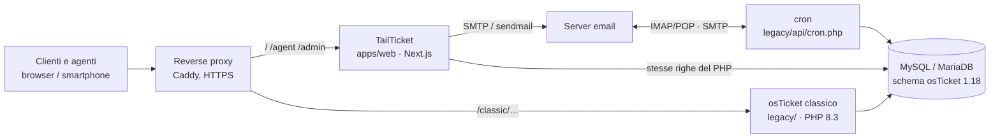

# Architettura

## Visione d'insieme



- **TailTicket (`apps/web/`)** serve il portale clienti (`/`), il pannello agenti (`/agent`) e l'area admin (`/admin`). Legge e scrive direttamente sul database osTicket.
- **osTicket classico (`legacy/`)** resta disponibile in `/classic/`. Esegue ciò che TailTicket non duplica: cron, fetch e pipe delle email, API REST, installer/upgrader, plugin.
- **Il database è uno solo**, con lo schema osTicket invariato. Il contratto tra le due parti è il [doc 17](reverse-engineering/17-contratto-scrittura.md).

## Struttura del repository

| Cartella | Contenuto | Note |
|---|---|---|
| `apps/web/` | app Next.js 16 (TypeScript strict, React 19, Tailwind v4, next-intl) | il codice di TailTicket |
| `legacy/` | osTicket 1.18.x originale (PHP) | si aggiorna solo da upstream ([upstream-sync.md](upstream-sync.md)) |
| `deploy/` | Docker Compose, immagine osTicket, Caddy, script `./tailticket` | [deploy/README.md](../deploy/README.md) |
| `docs/` | documentazione del fork, brand, screenshot, knowledge base di osTicket (`reverse-engineering/`) | [docs/README.md](README.md) |
| `.github/workflows/` | `ci.yml` (qualità + test differenziali), `images.yml` (immagini Docker) | |

**Perché `legacy/` separato.** Il codice osTicket non si tocca: è il riferimento contro cui verifichiamo TailTicket e il pezzo che riceve gli aggiornamenti upstream. Tenerlo in una cartella sua rende evidente il confine. Con `git merge -X subtree=legacy` gli aggiornamenti di osTicket si importano comunque con un merge normale.

## Dentro `apps/web`

```
src/
├── app/[locale]/
│   ├── (client)/        portale clienti: home, KB, login, ticket, apertura, profilo
│   ├── (staff)/agent/   pannello agenti
│   └── (staff)/admin/   area amministrazione (solo isadmin)
├── app/api/             upload, file allegati, export CSV, loghi
├── components/          UI per area (tickets/, people/, admin/, adminsys/, portal/, forms/dynamic/ …)
├── server/              SOLO lato server ("server-only")
│   ├── db/              Kysely + mysql2, prefisso tabelle, fuso del DB, tipi generati dallo schema
│   ├── config/          tabella config (core, nextui.* …)
│   ├── auth/            password phpass, sessioni agenti/clienti, 2FA, tentativi falliti
│   ├── domain/<area>/   porting delle classi include/class.*.php (ticket, thread, task, admin, …)
│   ├── mail/            mailer, template, variabili %{…}, Message-ID firmati
│   ├── format/, crypto/ compatibilità con Format::, Crypto:: di osTicket
│   └── system/          syslog, avvisi all'admin, compatibilità di schema
└── messages/            testi it/en per area
test/
├── unit/                test unitari
└── diff/                harness differenziale PHP vs TypeScript (runner PHP + operazioni per area)
```

Principi del codice:
- **l'accesso al DB passa solo dai servizi `src/server/domain/`**;
- **ogni scrittura** usa `runWrite`: una transazione, il contesto dell'attore, le email inviate dopo il commit, il controllo della firma di schema;
- **le pagine protette** ricontrollano sessione e permessi, così come ogni server action;
- regole complete per chi sviluppa: [apps/web/AGENTS.md](../apps/web/AGENTS.md).

## Flusso di una scrittura

1. L'agente invia il form, cioè una server action Next.
2. La server action ricontrolla la sessione e i permessi (`TicketPerm`, ruoli, reparto).
3. `runWrite`:
   - verifica la firma di schema;
   - apre la transazione;
   - chiama il servizio di dominio, per esempio `postReply`.
4. Il servizio scrive le stesse righe del PHP, nello stesso ordine:
   - `thread_entry`, `thread_event`, `_search`, `ticket`;
   - eventuali `lock`, `draft`, `attachment`.
5. Dopo il commit partono le email: template osTicket, Message-ID firmato.
6. Il pannello classico vede subito il risultato, perché è lo stesso DB.

## Sicurezza

- CSP con nonce, header di sicurezza, cookie `Secure`/`HttpOnly`/`SameSite`.
- Sessioni di agenti e clienti separate, firmate con `APP_SESSION_SECRET`. La tabella `session` del PHP non è condivisa.
- Password compatibili con osTicket (bcrypt phpass, MD5 legacy convertito al primo login).
- Segreti cifrati con `SECRET_SALT` come `Crypto::` di osTicket.
- I bug di sicurezza e permessi noti di osTicket **non** sono replicati: elenco nel doc 14 e nel doc 17 §3.

## Deploy

Lo stack di riferimento è in [deploy/](../deploy/README.md):
- `db`: MariaDB;
- `osticket` e `cron`: PHP 8.3 con il codice di `legacy/`;
- `tailticket`: Next standalone;
- `proxy`: Caddy con HTTPS automatico, che manda `/classic` al PHP e il resto a TailTicket.

Vincolo attuale: **una sola istanza** di TailTicket, perché 2FA e contatori dei tentativi stanno in memoria.
