# 02 — Database: schema completo, semantica dei campi, relazioni, dati seed

> Fonte: `setup/inc/streams/core/install-mysql.sql` (schema di installazione v1.18, signature `5fb92bef17f3b603659e024c01cc7a59`) + metadati ORM (`static $meta` di ogni modello) + seed YAML in `include/i18n/en_US/`.
> Tutte le tabelle hanno prefisso configurabile `%TABLE_PREFIX%` (default `ost_`). Charset `utf8` (3 byte), engine di default (InnoDB su MySQL moderni; `sequence`, `event`, `thread_referral` esplicitamente InnoDB).

## 0. Principi generali (da rispettare in una riscrittura)

1. **Nessuna foreign key fisica**, nessun `ON DELETE CASCADE`, nessuna stored procedure/trigger/view. L'integrità referenziale è gestita **solo dal codice** (vedi doc 03 per le cancellazioni a cascata manuali). In molte FK il valore `0` significa "nessuno" (invece di `NULL`).
2. **Associazioni polimorfiche** tramite coppie `(object_id, object_type)` con `object_type` di 1 carattere (vedi §1).
3. **Bitmask** nei campi `flags`/`status`/`mode`/`masks` (vedi §3 per tutti i bit).
4. **JSON in colonne `text`** per configurazioni/estensioni (`extra`, `configuration`, `properties`, `permissions`, `config`, `data`, `annotations`, `conditions`, `columns`, `setting`, `recipients`).
5. **EAV** per i campi dei form dinamici (`form_entry` + `form_entry_values`) con tabelle *materializzate* `*__cdata` ricostruibili.
6. **Config key/value** nella tabella `config` divisa per `namespace`.
7. `SQL_MODE=''`: inserimenti con valori mancanti non danno errore; molte colonne `NOT NULL` senza default si affidano a questo.
8. Date: `datetime` in ora del server MySQL (vedi doc 01 §12). `created`/`updated` sono valorizzate dal codice con `NOW()`.

## 1. Codici `object_type` / `type` polimorfici

Definiti in `ObjectModel` (`class.model.php`) e usati in più tabelle:

| Codice | Entità | Usato in |
|---|---|---|
| `T` | Ticket | `thread.object_type`, `form_entry.object_type`, `_search.object_type`, `thread_event.thread_type` |
| `C` | Child ticket (thread di un ticket fuso in un parent) | `thread.object_type` |
| `A` | Task | `thread.object_type`, `form_entry.object_type`, `thread_event.thread_type` |
| `U` | User | `form_entry.object_type`, `_search`, `note.ext_id` prefisso |
| `O` | Organization | `form_entry.object_type`, `_search`, `note.ext_id` prefisso |
| `H` | Thread entry | `attachment.type`, `_search.object_type` |
| `S` | Staff | `thread_referral.object_type`, `thread_event.uid_type` |
| `E` | Team | `thread_referral.object_type` |
| `D` | Department | `thread_referral.object_type` |
| `K` | FAQ | `_search` |
| `F` | File | (riservato) |
| `C` | Company (form_entry unico informazioni azienda) | `form_entry.object_type='C'` (attenzione: stesso carattere del child ticket ma tabella diversa) |

`attachment.type` (oggetto a cui è collegato il file):

| Codice | Proprietario |
|---|---|
| `H` | Thread entry (`thread_entry.id`) |
| `D` | Draft (`draft.id`) — immagini inline nelle bozze |
| `C` | Canned response (`canned_response.canned_id`) |
| `F` | FAQ (`faq.faq_id`) |
| `P` | Page/content (`content.id`) |
| `T` | Email template (`email_template.id`) |

`file.ft` (file type/uso): `T` = allegato generico (default), `L` = logo (client/staff), `B` = backdrop pagina login staff.
`file.bk` (storage backend): `D` = database (`file_chunk`), `F` = filesystem (plugin "storage-fs"), altri caratteri = backend di plugin (es. S3).

## 2. Elenco tabelle (68)

Raggruppate per dominio. `PK` in grassetto; `→` indica relazione logica (FK non dichiarata).

### 2.1 Configurazione e sistema

#### `config`
Key/value store di tutta la configurazione runtime.
| Colonna | Tipo | Note |
|---|---|---|
| **id** | int unsigned AI | |
| namespace | varchar(64) | `core` (sistema), `staff.<id>` (preferenze agente), `pwreset` (token reset password), `email.<email_id>.account.<account_id>` (credenziali/OAuth account email, valori cifrati), `plugin.<plugin_id>.instance.<instance_id>` (config istanza plugin), `schedule.<id>` (config orario: holidays), `mysqlsearch` (stato reindex), `dept.<id>`/`sla.<id>`/`topic.<id>` (non usati in core), namespace delle lingue (`i18n`)… |
| key | varchar(64) | UNIQUE(namespace,key) |
| value | text | stringa; booleani `0/1`; liste come CSV o JSON |
| updated | timestamp | default CURRENT_TIMESTAMP (usato anche come "creato" per i token pwreset) |

Il namespace `pwreset` contiene righe `key=<token casuale 32 char>`, `value='c'+user_id` (client) oppure `staff_id` (agente). Scadenza = `updated + pw_reset_window`.

Tutte le chiavi `core` sono elencate in **doc 13 (Admin & impostazioni)**.

#### `syslog`
Log di sistema.
| Colonna | Tipo | Note |
|---|---|---|
| **log_id** | int AI | |
| log_type | enum('Debug','Warning','Error') | livello |
| title | varchar(255) | |
| log | text | messaggio (può contenere backtrace HTML) |
| logger | varchar(64) | sempre `''` nel core |
| ip_address | varchar(64) | IP del client |
| created, updated | datetime | |

Scrittura condizionata da `config.log_level` (1=Error, 2=Warning, 3=Debug): si scrive se livello evento ≤ log_level. Purge dopo `log_graceperiod` mesi.

#### `session`
Sessioni PHP (handler DB).
| Colonna | Tipo | Note |
|---|---|---|
| **session_id** | varchar(255) ascii | id sessione |
| session_data | blob | payload serializzato PHP |
| session_expire | datetime | scadenza |
| session_updated | datetime | ultimo update |
| user_id | varchar(16) | `<staff_id>` per agenti, `0` per altro (usato per "chi è online" e per forzare logout) |
| user_ip | varchar(64) | |
| user_agent | varchar(255) | |

#### `api_key`
| Colonna | Tipo | Note |
|---|---|---|
| **id** | int AI | |
| isactive | tinyint(1) | |
| ipaddr | varchar(64) | IP autorizzato (match **esatto** con REMOTE_ADDR) |
| apikey | varchar(255) UNIQUE | 48 char maiuscoli A-Z0-9 generati |
| can_create_tickets | tinyint | permesso POST /tickets |
| can_exec_cron | tinyint | permesso POST /tasks/cron |
| notes | text | |
| updated, created | datetime | |

#### `sequence`
Contatori per numerazione ticket/task (InnoDB, row lock).
| Colonna | Tipo | Note |
|---|---|---|
| **id** | int AI | |
| name | varchar(64) | |
| flags | int | `0x1` INTERNAL (non eliminabile) |
| next | bigint | prossimo valore |
| increment | int | passo (default 1) |
| padding | char(1) | carattere di riempimento a sinistra (default `0`) |
| updated | datetime | |

Algoritmo `Sequence::next($format)`: `SELECT ... FOR UPDATE` in transazione, legge `next`, `next += increment`, commit. Il formato (`ticket_number_format`, default `######`) sostituisce ogni gruppo di `#` con cifre del numero (zero-padded al totale degli `#`); `\#` = `#` letterale; cifre in eccesso aggiunte dopo l'ultimo gruppo. Se la sequenza configurata è `0` si usa **RandomSequence**: numero casuale di N cifre (N = numero di `#`, min 6) ripetuto finché non è univoco (`Ticket::isTicketNumberUnique`).

Seed: id 1 "General Tickets", id 2 "Tasks Sequence".

#### `translation`
Traduzioni dei contenuti del DB (titoli help topic, FAQ, pagine, nomi reparti, etichette campi…).
| Colonna | Tipo | Note |
|---|---|---|
| **id** | int AI | |
| object_hash | char(16) ascii | `_H(tag) = substr(md5(tag), -16)` (ultimi 16 caratteri esadecimali dell'MD5) dove `tag` = `<oggetto>.<campo>.<id>`, es. `dept.name.5`, `topic.name.3`, `form.title.2`, `field.label.20`, `category.name.1`, `faq.question.1`, `sla.name.1`, `page.<id>`… (vedi doc 12) |
| type | enum('phrase','article','override') | `phrase`=stringa breve, `article`=contenuto complesso (JSON `{name, body}`), `override` |
| flags | int | 0x01 FUZZY, 0x02 UNAPPROVED, 0x04 CURRENT, 0x08 COMPLEX |
| revision | int | |
| agent_id | int | autore |
| lang | varchar(16) | es. `it_IT` |
| text | mediumtext | testo tradotto (JSON se complesso) |
| source_text | text | testo originale al momento della traduzione |
| updated | timestamp | |

#### `plugin`
| Colonna | Tipo | Note |
|---|---|---|
| **id** | int AI | |
| name | varchar(255) | |
| install_path | varchar(60) UNIQUE | path relativo a `include/plugins/` (dir o `.phar`) |
| isphar | tinyint | |
| isactive | tinyint | |
| version | varchar(64) | |
| notes | text | |
| installed | datetime | |

#### `plugin_instance`
| Colonna | Tipo | Note |
|---|---|---|
| **id** | int AI | |
| plugin_id | int → plugin.id | |
| flags | int | `0x1` ENABLED |
| name | varchar(255) | |
| notes | text | |
| created, updated | datetime | |
Config dell'istanza in `config` namespace `plugin.<plugin_id>.instance.<id>`.

#### `_search` (creata dal backend di ricerca, non nell'install SQL)
```sql
CREATE TABLE ost__search (
  object_type varchar(8) NOT NULL,   -- T (ticket: number+subject), H (thread entry: title+body), U (user: name + emails), O (org), K (FAQ)
  object_id int unsigned NOT NULL,
  title text, content text,
  PRIMARY KEY (object_type, object_id),
  FULLTEXT KEY search (title, content)
) -- MyISAM su MySQL 5.5, InnoDB su ≥5.6 / Galera
```
Popolata in modo sincrono su creazione/modifica (`SearchInterface` ascolta i segnali) e a batch dal cron per i record non indicizzati (`config mysqlsearch.reindex=1`).

### 2.2 Ticket

#### `ticket`
| Colonna | Tipo | Note |
|---|---|---|
| **ticket_id** | int AI | |
| ticket_pid | int NULL → ticket.ticket_id | parent se il ticket è stato **fuso** (merge) in un altro |
| number | varchar(20) | numero esterno visibile (es. `482913`), generato da Sequence/formato di help topic o di sistema |
| user_id | int → user.id | utente proprietario (richiedente) |
| user_email_id | int → user_email.id | email specifica usata (0 = default) |
| status_id | int → ticket_status.id | |
| dept_id | int → department.id | reparto proprietario |
| sla_id | int → sla.id | 0 = nessuno |
| topic_id | int → help_topic.topic_id | 0 = nessuno |
| staff_id | int → staff.staff_id | agente assegnato (0 = nessuno) |
| team_id | int → team.team_id | team assegnato (0 = nessuno) |
| email_id | int → email.email_id | email di sistema da cui è arrivato / con cui rispondere |
| lock_id | int → lock.lock_id | lock attivo (0 = nessuno) |
| flags | int | 0x01 COMBINE_THREADS, 0x02 SEPARATE_THREADS, 0x08 LINKED, 0x10 PARENT (vedi doc 05 merge) |
| sort | int | ordinamento dei child dentro un parent |
| ip_address | varchar(64) | IP del creatore |
| source | enum('Web','Email','Phone','API','Other') | canale |
| source_extra | varchar(40) | dettaglio canale (es. "Mail fetch", "Piping"…); nullable |
| isoverdue | tinyint | 1 se scaduto (settato da cron o manualmente) |
| isanswered | tinyint | 1 se l'ultimo post è dell'agente (risposta) |
| duedate | datetime | scadenza **manuale** impostata da agente/API (override) |
| est_duedate | datetime | scadenza **calcolata** dallo SLA + schedule |
| reopened | datetime | ultima riapertura |
| closed | datetime | ultima chiusura |
| lastupdate | datetime | ultima attività significativa (post/cambio) |
| created | datetime | |
| updated | datetime | |
Indici: user_id, dept_id, staff_id, team_id, status_id, created, closed, duedate, topic_id, sla_id, ticket_pid.

Campi "derivati": `subject` e `priority` NON sono colonne di `ticket`; stanno nel form dinamico "Ticket Details" (`form_entry` tipo T) e nella vista `ticket__cdata`.

#### `ticket__cdata` (materializzata, dinamica)
`CREATE TABLE ost_ticket__cdata (PRIMARY KEY(ticket_id)) AS SELECT entry.object_id AS ticket_id, MAX(IF(field.id=20, COALESCE(ans.value_id, ans.value), NULL)) AS subject, ... FROM form_entry entry JOIN form_entry_values ans ... JOIN form_field field ... WHERE entry.object_type='T' GROUP BY entry.object_id`.
- Una colonna per ogni campo del form Ticket (tipo `T`) che ha dati: nome colonna = `form_field.name` oppure `field_<id>`.
- Per campi a scelta (choice/selection/list) il valore è il JSON `{"id":"label"}` "appiattito" (rimozione di `{`,`}`,`"`, `:`→`,`), per altri `COALESCE(value_id, value)`.
- Colonne tipiche: `ticket_id`, `subject`, `priority` (= `priority_id` numerico perché il campo priority salva `value_id`).
- Aggiornamento: su ogni insert/update di `form_entry_values` del form T → `INSERT ... ON DUPLICATE KEY UPDATE`. Su aggiunta/eliminazione/rinomina campo → `DROP TABLE` e rebuild (anche al cron se mancante).
Analoghe: `user__cdata` (PK `user_id`, form U), `organization__cdata` (PK `org_id`, form O), `task__cdata` (PK `task_id`, form A).

Uso: ordinamento/filtri/colonne delle code (`cdata__subject`, `cdata__priority`), ricerca avanzata.

#### `ticket_status`
| Colonna | Tipo | Note |
|---|---|---|
| **id** | int AI | |
| name | varchar(60) UNIQUE | |
| state | varchar(16) | `open`, `closed`, `archived`, `deleted` (stato logico) |
| mode | int | bitmask: 0x1 ENABLED, 0x2 INTERNAL (non eliminabile/rinominabile) |
| flags | int | riservato |
| sort | int | |
| properties | text JSON | `{"description":..., "allowreopen":bool, "reopenstatus":<id>|0}` (+ eventuali campi del form proprietà) |
| created, updated | datetime | |
Seed: 1 Open(open), 2 Resolved(closed, mode 1), 3 Closed(closed), 4 Archived(archived), 5 Deleted(deleted). Modalità 3 = enabled+internal.

#### `ticket_priority`
| Colonna | Tipo | Note |
|---|---|---|
| **priority_id** | tinyint AI | |
| priority | varchar(60) UNIQUE | chiave (`low`, `normal`, `high`, `emergency`) |
| priority_desc | varchar(30) | etichetta (Low, Normal…) |
| priority_color | varchar(7) | colore HTML |
| priority_urgency | tinyint | 1 = più urgente (ordinamento `-priority_urgency`… attenzione: meta ordering `-priority_urgency`) |
| ispublic | tinyint | visibile ai clienti |
Seed: 1 low(urg 4), 2 normal(3), 3 high(2), 4 emergency(1). Default sistema `default_priority_id=2`.

#### `lock`
| Colonna | Tipo | Note |
|---|---|---|
| **lock_id** | int AI | |
| staff_id | int → staff | chi possiede il lock |
| expire | datetime | scadenza (NOW + `autolock_minutes`) |
| code | varchar(20) | codice casuale anti-CSRF/anti-race restituito al browser e richiesto al submit |
| created | datetime | |
Referenziato da `ticket.lock_id` e `task.lock_id`. Modalità (`config.ticket_lock`): 0 disabilitato, 1 lock alla visualizzazione, 2 lock all'attività (default).

### 2.3 Thread (conversazioni) ed eventi

#### `thread`
Un thread per ticket/task (relazione 1:1 via oggetto polimorfico).
| Colonna | Tipo | Note |
|---|---|---|
| **id** | int AI | |
| object_id | int | id del ticket/task |
| object_type | char(1) | `T` ticket, `A` task, `C` child (thread di ticket fuso) |
| extra | text JSON | per `C`: `{"ticket_id": <parent>, "number": "<numero originario>"}` |
| lastresponse | datetime | ultima risposta agente |
| lastmessage | datetime | ultimo messaggio cliente |
| created | datetime | |

#### `thread_entry`
| Colonna | Tipo | Note |
|---|---|---|
| **id** | int AI | |
| pid | int → thread_entry.id | entry "padre" (per entry modificate: la nuova versione punta all'originale / storico edit) |
| thread_id | int → thread.id | |
| staff_id | int → staff | autore agente (R, N) |
| user_id | int → user | autore utente (M) o collaboratore |
| type | char(1) | `M` message (cliente), `R` response (agente), `N` note (nota interna) |
| flags | int | vedi §3 ThreadEntry |
| poster | varchar(128) | nome visualizzato dell'autore al momento del post |
| editor | int NULL | id di chi ha modificato |
| editor_type | char(1) NULL | `S` staff / `U` user |
| source | varchar(32) | `Web`, `Email`, `API`, `Phone`… |
| title | varchar(255) | titolo (note, oggetto email) |
| body | text | corpo (HTML sanitizzato o testo) ; `-` = vuoto |
| format | varchar(16) | `html` o `text` |
| ip_address | varchar(64) | |
| extra | text JSON | es. `{"thread": <thread originale>}` per entry spostate da merge |
| recipients | text JSON | destinatari della risposta: `{"to":[...], "cc":[...]}` |
| created, updated | datetime | |

#### `thread_entry_email`
Metadati email di un entry (per threading delle risposte).
| Colonna | Tipo | Note |
|---|---|---|
| **id** | int AI | |
| thread_entry_id | int → thread_entry.id | 0 se messaggio rifiutato (traccia solo il Message-Id per non rielaborarlo) |
| email_id | int → email.email_id | mailbox di arrivo |
| mid | varchar(255) | Message-ID (indicizzato) |
| headers | text | header grezzi (se `save_email_headers`) |

#### `thread_entry_merge`
| Colonna | Tipo | Note |
|---|---|---|
| **id** | int AI | |
| thread_entry_id | int → thread_entry.id | |
| data | text JSON | info sull'origine dell'entry dopo un merge (ticket/numero originario) |

#### `event`
Catalogo nomi evento (id stabili):
1 created, 2 closed, 3 reopened, 4 assigned, 5 released, 6 transferred, 7 referred, 8 overdue, 9 edited, 10 viewed, 11 error, 12 collab, 13 resent, 14 deleted, 15 merged, 16 unlinked, 17 linked, 18 login, 19 logout, 20 message, 21 note.

#### `thread_event`
Audit/timeline degli eventi di ticket e task; base di tutte le statistiche (dashboard).
| Colonna | Tipo | Note |
|---|---|---|
| **id** | int AI | |
| thread_id | int → thread.id | |
| thread_type | char(1) | `T` / `A` |
| event_id | int → event.id | |
| staff_id | int | **snapshot** assegnatario al momento (o agente corrente se non assegnato) |
| team_id | int | snapshot team |
| dept_id | int | snapshot reparto |
| topic_id | int | snapshot help topic |
| data | varchar(1024) JSON | dettagli: es. `{"staff":5}`, `{"team":2}`, `{"claim":true}`, `{"status":[3,"Closed"]}`, `{"dept":4}`, `{"fields":{...}}` (edit), `{"add":{...}}`/`{"del":{...}}` (collab), `{"child":...}` (merge)… |
| username | varchar(128) | nome di chi ha agito (`SYSTEM` default) |
| uid | int | id dell'attore |
| uid_type | char(1) | `S` staff, `U` user |
| annulled | tinyint | 1 se l'evento è stato "annullato" (es. una riapertura annulla il `closed` precedente; serve a non contare doppio nelle statistiche) |
| timestamp | datetime | |
Indici: `(thread_id, event_id, timestamp)`, `(timestamp, event_id)`.

#### `thread_collaborator`
| Colonna | Tipo | Note |
|---|---|---|
| **id** | int AI | |
| flags | int | 0x1 ACTIVE, 0x2 CC (in copia nelle risposte) |
| thread_id | int → thread.id | |
| user_id | int → user.id | |
| role | char(1) | `M` (riceve messaggi: cliente), `N` (note: terza parte), `R` (risposte: autorità esterna) — nel core si usa `M` |
| created, updated | datetime | |
UNIQUE(thread_id, user_id).

#### `thread_referral`
Condivisione del thread (visibilità) con altri agenti/team/reparti.
| Colonna | Tipo | Note |
|---|---|---|
| **id** | int AI | |
| thread_id | int → thread.id | |
| object_id | int | id destinatario |
| object_type | char(1) | `S` staff, `E` team, `D` dept |
| created | datetime | |
UNIQUE(object_id, object_type, thread_id).

### 2.4 Task

#### `task`
| Colonna | Tipo | Note |
|---|---|---|
| **id** | int AI | |
| object_id | int | id dell'oggetto padre (ticket_id) o 0 |
| object_type | char(1) | `T` se legato a ticket, altrimenti vuoto |
| number | varchar(20) | numero task (sequenza 2, formato `task_number_format` default `#`) |
| dept_id | int → department | |
| staff_id | int → staff | assegnato |
| team_id | int → team | assegnato |
| lock_id | int → lock | |
| flags | int | 0x1 ISOPEN, 0x2 ISOVERDUE |
| duedate | datetime | scadenza |
| closed | datetime | |
| created, updated | datetime | |
Titolo e descrizione nel form dinamico tipo `A` (`task__cdata.title`). Thread con `object_type='A'`.

### 2.5 Utenti finali e organizzazioni

#### `user`
| Colonna | Tipo | Note |
|---|---|---|
| **id** | int AI | |
| org_id | int → organization.id | 0 = nessuna |
| default_email_id | int → user_email.id | email principale |
| status | int | 0x1 PRIMARY_ORG_CONTACT (contatto primario dell'organizzazione) |
| name | varchar(128) | nome completo (formattato secondo `client_name_format`) |
| created, updated | datetime | |

#### `user_email`
| Colonna | Tipo | Note |
|---|---|---|
| **id** | int AI | |
| user_id | int → user.id | |
| flags | int | riservato |
| address | varchar(255) UNIQUE | email (univoca su tutto il sistema → identifica l'utente) |

#### `user_account`
Credenziali di login (solo per utenti registrati).
| Colonna | Tipo | Note |
|---|---|---|
| **id** | int AI | |
| user_id | int → user.id | 1:1 |
| status | int | 0x1 CONFIRMED, 0x2 LOCKED, 0x4 REQUIRE_PASSWD_RESET, 0x8 FORBID_PASSWD_RESET |
| timezone | varchar(64) | |
| lang | varchar(16) | |
| username | varchar(64) UNIQUE | opzionale (login anche per email) |
| passwd | varchar(128) ascii_bin | hash bcrypt (`password_hash`) |
| backend | varchar(32) | backend di autenticazione esterno (es. `ldap`), NULL = locale |
| extra | text JSON | `{"browser_lang":..., "mailouts_lang"...}` |
| registered | timestamp | |

#### `user__cdata`
Vista materializzata del form utente (tipo U): `user_id`, `email`, `name`, `phone`, `notes`, + campi custom.

#### `organization`
| Colonna | Tipo | Note |
|---|---|---|
| **id** | int AI | |
| name | varchar(128) | |
| manager | varchar(16) | account manager: `s<staff_id>` o `t<team_id>` o vuoto |
| status | int | 0x01 COLLAB_ALL_MEMBERS (aggiunge tutti i membri come collaboratori), 0x02 COLLAB_PRIMARY_CONTACT (aggiunge i contatti primari), 0x04 ASSIGN_AGENT_MANAGER (auto-assegna i ticket al manager), 0x08 SHARE_PRIMARY_CONTACT (i contatti primari vedono i ticket dell'org), 0x10 SHARE_EVERYBODY (tutti i membri vedono i ticket dell'org) |
| domain | varchar(256) | domini email (CSV) per auto-associazione nuovi utenti |
| extra | text JSON | |
| created, updated | timestamp | |

#### `organization__cdata`
Vista materializzata form organizzazione (tipo O): `org_id`, `name`, `address`, `phone`, `website`, `notes` + custom.

#### `note`
Note rapide ("quick notes") su utenti/organizzazioni.
| Colonna | Tipo | Note |
|---|---|---|
| **id** | int AI | |
| pid | int | nota padre (non usato) |
| staff_id | int → staff | autore |
| ext_id | varchar(10) | `U<user_id>` o `O<org_id>` |
| body | text | HTML |
| status | int | |
| sort | int | |
| created, updated | timestamp | |

### 2.6 Agenti, reparti, team, ruoli

#### `staff`
| Colonna | Tipo | Note |
|---|---|---|
| **staff_id** | int AI | |
| dept_id | int → department.id | **reparto primario** |
| role_id | int → role.id | **ruolo nel reparto primario** |
| username | varchar(32) UNIQUE | |
| firstname, lastname | varchar(32) | |
| passwd | varchar(128) | hash bcrypt (o legacy MD5/phpass, aggiornato al login) |
| backend | varchar(32) | backend auth (NULL = locale) |
| email | varchar(255) | |
| phone | varchar(24) | |
| phone_ext | varchar(6) | |
| mobile | varchar(24) | |
| signature | text | firma personale |
| lang | varchar(16) | lingua preferita |
| timezone | varchar(64) | |
| locale | varchar(16) | locale formati |
| notes | text | note admin |
| isactive | tinyint | 0 = account bloccato |
| isadmin | tinyint | amministratore (accesso area admin) |
| isvisible | tinyint | visibile nella directory |
| onvacation | tinyint | in ferie: escluso da auto-assegnazioni/alert |
| assigned_only | tinyint | vede solo ticket assegnati a sé (o ai suoi team) |
| show_assigned_tickets | tinyint | mostra ticket assegnati nelle code "open" |
| change_passwd | tinyint | forza cambio password al prossimo login |
| max_page_size | int | righe per pagina (0 = default sistema) |
| auto_refresh_rate | int | minuti refresh automatico code (0 = off) |
| default_signature_type | enum('none','mine','dept') | firma predefinita nelle risposte |
| default_paper_size | enum('Letter','Legal','Ledger','A4','A3') | stampa PDF |
| extra | text JSON | `{"def_assn_role":bool (reparto: assegna ruolo primario ai reparti estesi), "browser_lang":..., "avatar":..., "2fa": ...}` |
| permissions | text JSON | permessi **globali** dell'agente (non legati a reparto): `{"user.create":1,"user.edit":1,"org.create":1,"faq.manage":1,"emails.banlist":1,"search.all":1,"stats.agents":1,"visibility.agents":1,"visibility.departments":1,...}` |
| created | datetime | |
| lastlogin | datetime | |
| passwdreset | datetime | ultimo cambio password (per scadenza `passwd_reset_period` mesi) |
| updated | datetime | |
Preferenze aggiuntive in `config` namespace `staff.<id>`: `default_from_name`, `datetime_format` (`''` o `relative`), `thread_view_order` (`asc`/`desc`), `default_ticket_queue_id`, `reply_redirect` (`Ticket`/`Queue`), `img_att_view` (`download`/`inline`), `editor_spacing` (`single`/`double`), configurazione 2FA (`<id backend 2FA>` → JSON).

#### `staff_dept_access`
Accesso **esteso** di un agente ad altri reparti con ruolo specifico.
| Colonna | Tipo | Note |
|---|---|---|
| **staff_id** | int → staff | PK composta |
| **dept_id** | int → department | PK composta |
| role_id | int → role | ruolo in quel reparto |
| flags | int | 0x1 ALERTS (riceve alert del reparto) — default 1 |

#### `department`
| Colonna | Tipo | Note |
|---|---|---|
| **id** | int AI | |
| pid | int NULL → department.id | reparto padre (gerarchia) |
| tpl_id | int → email_template_group.tpl_id | template email del reparto (0 = default sistema) |
| sla_id | int → sla.id | SLA default reparto |
| schedule_id | int → schedule.id | orario lavorativo reparto |
| email_id | int → email.email_id | email in uscita del reparto |
| autoresp_email_id | int → email.email_id | email per auto-risposte |
| manager_id | int → staff | responsabile |
| flags | int | 0x01 ASSIGN_MEMBERS_ONLY (assegnabile solo a membri), 0x02 DISABLE_AUTO_CLAIM, 0x04 ACTIVE, 0x08 ARCHIVED, 0x10 ASSIGN_PRIMARY_ONLY (solo membri primari), 0x20 DISABLE_REOPEN_AUTO_ASSIGN |
| name | varchar(128) | UNIQUE(name, pid) |
| signature | text | firma reparto |
| ispublic | tinyint | selezionabile/visibile ai clienti |
| group_membership | tinyint | alert: 0 ALERTS_DEPT_ONLY (solo membri primari), 1 ALERTS_DEPT_AND_EXTENDED (anche estesi), 2 ALERTS_DISABLED, 3 ALERTS_ADMIN_ONLY |
| ticket_auto_response | tinyint | invia auto-risposta nuovo ticket |
| message_auto_response | tinyint | invia auto-risposta nuovo messaggio |
| path | varchar(128) | path gerarchico materializzato `/1/5/` |
| updated, created | datetime | |
Stato reparto derivato dai flag: Active (ACTIVE), Archived (ARCHIVED), Disabled (nessuno dei due).

#### `team`
| Colonna | Tipo | Note |
|---|---|---|
| **team_id** | int AI | |
| lead_id | int → staff | team leader |
| flags | int | 0x1 ENABLED, 0x2 NOALERTS (non avvisare i membri sulle assegnazioni) |
| name | varchar(125) UNIQUE | |
| notes | text | |
| created, updated | datetime | |

#### `team_member`
| Colonna | Tipo | Note |
|---|---|---|
| **team_id** | int | PK composta |
| **staff_id** | int | PK composta |
| flags | int | 0x1 ALERTS (riceve alert del team) |

#### `role`
| Colonna | Tipo | Note |
|---|---|---|
| **id** | int AI | |
| flags | int | 0x1 ENABLED |
| name | varchar(64) UNIQUE | |
| permissions | text JSON | `{"ticket.create":1,"ticket.edit":1,...}` (permessi legati al reparto) |
| notes | text | |
| created, updated | datetime | |
Seed: 1 All Access, 2 Expanded Access, 3 Limited Access, 4 View only. Elenco permessi in doc 08.

#### `group` (LEGACY)
Tabella dei vecchi "gruppi" (≤1.9) mantenuta per compatibilità/migrazione: `id, role_id, flags, name, notes, created, updated`. Il seed crea 3 gruppi (Lion Tamers, Elephant Walkers, Flea Trainers) solo per l'installer; il codice runtime **non la usa** più (sostituita da role + staff_dept_access). Può essere omessa in una riscrittura.

### 2.7 Help topic, SLA, orari

#### `help_topic`
| Colonna | Tipo | Note |
|---|---|---|
| **topic_id** | int AI | |
| topic_pid | int → help_topic | padre (gerarchia; nome visualizzato `Padre / Figlio`) |
| ispublic | tinyint | visibile sul portale |
| noautoresp | tinyint | disabilita auto-risposta nuovo ticket |
| flags | int | 0x1 CUSTOM_NUMBERS (usa sequence/formato propri), 0x2 ACTIVE, 0x4 ARCHIVED |
| status_id | int → ticket_status | stato iniziale ticket (0 = default) |
| priority_id | int → ticket_priority | priorità default |
| dept_id | int → department | reparto destinazione (0 = default sistema) |
| staff_id | int → staff | auto-assegnazione agente |
| team_id | int → team | auto-assegnazione team |
| sla_id | int → sla | SLA (0 = quello del reparto/sistema) |
| page_id | int → content | pagina "thank you" specifica |
| sequence_id | int → sequence | sequenza numerazione (se CUSTOM_NUMBERS) |
| sort | int | ordinamento manuale (`help_topic_sort_mode='m'`) |
| topic | varchar(128) | nome; UNIQUE(topic, topic_pid) |
| number_format | varchar(32) | formato numero (se CUSTOM_NUMBERS) |
| notes | text | |
| created, updated | datetime | |

#### `help_topic_form`
Form aggiuntivi per topic (ordinati).
| Colonna | Tipo | Note |
|---|---|---|
| **id** | int AI | |
| topic_id | int → help_topic | |
| form_id | int → form | (`4294967295` = FORM_USE_PARENT: eredita dal topic padre) |
| sort | int | ordine |
| extra | text JSON | `{"disable":[field_id,...]}` campi disattivati per questo topic |

#### `sla`
| Colonna | Tipo | Note |
|---|---|---|
| **id** | int AI | |
| schedule_id | int → schedule | orario per il calcolo (0 = orario reparto/sistema) |
| flags | int | 0x1 ACTIVE, 0x2 ESCALATE ("enable_priority_escalation": memorizzato ma non usato dalla logica core), 0x4 NOALERTS (niente alert overdue), 0x8 TRANSIENT (SLA sostituibile: al cambio reparto/topic il ticket prende lo SLA del nuovo reparto/topic) |
| grace_period | int | ore |
| name | varchar(64) UNIQUE | |
| notes | text | |
| created, updated | datetime | |
Seed: "Default SLA", 18 ore, flags 3.

#### `schedule`
| Colonna | Tipo | Note |
|---|---|---|
| **id** | int AI | |
| flags | int | 0x1 BIZHRS (orario lavorativo; senza = calendario festività) |
| name | varchar(255) | |
| timezone | varchar(64) | fuso dell'orario (NULL = sistema) |
| description | varchar(255) | |
| created, updated | datetime | |
Config in `config` namespace `schedule.<id>`: `holidays` = JSON lista id schedule-festività da escludere.

#### `schedule_entry`
| Colonna | Tipo | Note |
|---|---|---|
| **id** | int AI | |
| schedule_id | int → schedule | |
| flags | int | |
| sort | tinyint | |
| name | varchar(255) | es. "Monday", "Christmas Day" |
| repeats | varchar(16) | `never`, `daily`, `weekdays`, `weekends`, `weekly`, `monthly`, `yearly` |
| starts_on | date | data di inizio validità |
| starts_at | time | ora inizio |
| ends_on | date | |
| ends_at | time | ora fine |
| stops_on | datetime | fine ricorrenza |
| day | tinyint | giorno settimana (1=lun…7=dom) o giorno del mese |
| week | tinyint | n-esima settimana del mese (1..5, -1 = ultima) |
| month | tinyint | mese (yearly) |
| created, updated | datetime | |
Seed: "Monday - Friday 8am - 5pm with U.S. Holidays" (id 1, holidays=[4]), "24/7" (2), "24/5" (3), "U.S. Holidays" (4).

### 2.8 Email

#### `email`
Indirizzi email di sistema.
| Colonna | Tipo | Note |
|---|---|---|
| **email_id** | int AI | |
| noautoresp | tinyint | non inviare auto-risposte per ticket da questa email |
| priority_id | int → ticket_priority | priorità dei ticket in arrivo |
| dept_id | int → department | reparto dei ticket in arrivo |
| topic_id | int → help_topic | topic dei ticket in arrivo |
| email | varchar(255) UNIQUE | indirizzo |
| name | varchar(255) | nome mittente |
| notes | text | |
| created, updated | datetime | |

#### `email_account`
Account di trasporto (mailbox in ingresso e SMTP in uscita) collegati a un'email.
| Colonna | Tipo | Note |
|---|---|---|
| **id** | int AI | |
| email_id | int → email | |
| type | enum('mailbox','smtp') | |
| auth_bk | varchar(128) | backend auth: `basic` (user/password, "legacy"), `oauth2:<provider>` (provider registrati da plugin OAuth2: Google, Microsoft…), per SMTP anche `mailbox` (stesse credenziali della mailbox) o `none` |
| auth_id | varchar(16) | id credenziali (md5 abbreviato) in config namespace `email.<eid>.account.<aid>` |
| active | tinyint | |
| host | varchar(128) | |
| port | int | |
| folder | varchar(255) | cartella IMAP (default INBOX) |
| protocol | enum('IMAP','POP','SMTP','OTHER') | |
| encryption | enum('NONE','AUTO','SSL') | |
| fetchfreq | tinyint | minuti tra fetch |
| fetchmax | tinyint | max messaggi per fetch |
| postfetch | enum('archive','delete','nothing') | azione dopo il fetch |
| archivefolder | varchar(255) | cartella di archivio |
| allow_spoofing | tinyint | (SMTP) consente From diverso dall'account |
| num_errors | int | errori consecutivi (dopo soglia la mailbox viene disattivata) |
| last_error_msg | tinytext | |
| last_error | datetime | |
| last_activity | datetime | ultimo fetch |
| created, updated | datetime | |

#### `email_template_group`
Set di template email (uno per lingua/variante).
| Colonna | Tipo | Note |
|---|---|---|
| **tpl_id** | int AI | |
| isactive | tinyint | |
| name | varchar(32) | |
| lang | varchar(16) | lingua del set |
| notes | text | |
| created | datetime | |
| updated | timestamp | |

#### `email_template`
| Colonna | Tipo | Note |
|---|---|---|
| **id** | int AI | |
| tpl_id | int → email_template_group | |
| code_name | varchar(32) | uno di: `ticket.autoresp`, `ticket.autoreply`, `message.autoresp`, `ticket.notice`, `ticket.overlimit`, `ticket.reply`, `ticket.activity.notice`, `ticket.alert`, `message.alert`, `note.alert`, `assigned.alert`, `transfer.alert`, `ticket.overdue`, `task.alert`, `task.activity.notice`, `task.activity.alert`, `task.assignment.alert`, `task.transfer.alert`, `task.overdue.alert` |
| subject | varchar(255) | con variabili `%{...}` |
| body | text | HTML con variabili |
| notes | text | |
| created, updated | datetime | |
UNIQUE(tpl_id, code_name). Se un code_name manca nel gruppo, viene caricato dal YAML della lingua (fallback).

#### `canned_response`
| Colonna | Tipo | Note |
|---|---|---|
| **canned_id** | int AI | |
| dept_id | int → department | 0 = tutti i reparti |
| isenabled | tinyint | |
| title | varchar(255) UNIQUE | |
| response | text | HTML con variabili `%{ticket.*}` |
| lang | varchar(16) | |
| notes | text | |
| created, updated | datetime | |
Allegati: `attachment.type='C'`.

#### `filter`
Regole automatiche su ticket in arrivo (e system ban list).
| Colonna | Tipo | Note |
|---|---|---|
| **id** | int AI | |
| execorder | int | ordine esecuzione (crescente) |
| isactive | tinyint | |
| flags | int | 0x1 INACTIVE_HT (help topic azione disattivato), 0x2 INACTIVE_DEPT (reparto azione disattivato), 0x4 DELETED_OBJECT (oggetto riferito eliminato) — segnalazioni di "filtro rotto" |
| status | int | riservato |
| match_all_rules | tinyint | 1 = AND, 0 = OR |
| stop_onmatch | tinyint | interrompe i filtri successivi se match |
| target | enum('Any','Web','Email','API') | canale a cui si applica |
| email_id | int → email | se target=Email, limita ad una specifica mailbox (0 = tutte) |
| name | varchar(32) | (`SYSTEM BAN LIST` è speciale) |
| notes | text | |
| created, updated | datetime | |

#### `filter_rule`
| Colonna | Tipo | Note |
|---|---|---|
| **id** | int AI | |
| filter_id | int → filter | |
| what | varchar(32) | campo confrontato: `name`, `email` (utente), `reply-to`, `reply-to-name`, `addressee` (To+Cc concatenati), `topicId`, `field.<field_id>` / `field.<field_id>.<sub_id>` per i campi dei form Ticket/User/Organization/custom (es. `field.20` = subject, `field.21` = body del messaggio) |
| how | enum('equal','not_equal','contains','dn_contain','starts','ends','match','not_match') | `match` = regex |
| val | varchar(255) | |
| isactive | tinyint | |
| notes | tinytext | |
| created, updated | datetime | |
UNIQUE(filter_id, what, how, val).

#### `filter_action`
| Colonna | Tipo | Note |
|---|---|---|
| **id** | int AI | |
| filter_id | int → filter | |
| sort | int | ordine |
| type | varchar(24) | `reject` (rifiuta), `replyto` (usa Reply-To come utente), `noresp` (disabilita auto-risposta), `canned` (invia canned response automatica), `dept` (instrada a reparto), `pri` (imposta priorità), `sla`, `team` (assegna team), `agent` (assegna agente), `topic` (imposta help topic), `status` (imposta stato), `email` (invia email a indirizzi) — più tipi registrati da plugin (vedi doc 09) |
| configuration | text JSON | parametri dell'azione |
| updated | datetime | |

### 2.9 Form dinamici e liste

#### `form`
| Colonna | Tipo | Note |
|---|---|---|
| **id** | int AI | |
| pid | int | form padre (non usato) |
| type | varchar(8) | `T` ticket details (unico), `U` contact info utente (unico), `O` organizzazione (unico), `A` task (unico), `C` company info (unico), `G` generico/custom (collegabile ai topic), `L<list_id>` form proprietà di una lista |
| flags | int | 0x1 DELETABLE, 0x2 DELETED |
| title | varchar(255) | |
| instructions | varchar(512) | |
| name | varchar(64) | |
| notes | text | |
| created, updated | datetime | |

#### `form_field`
| Colonna | Tipo | Note |
|---|---|---|
| **id** | int AI | (seed fissi: 20 subject, 21 message, 22 priority del form Ticket) |
| form_id | int → form | |
| flags | int | bitmask visibilità/obbligatorietà/mask (vedi §3 DynamicFormField) |
| type | varchar(255) | `text`, `memo`, `thread`, `phone`, `datetime`, `bool`, `choices`, `files`, `break` (section), `info` (testo statico), `priority`, `state`, `timezone`, `department`, `assignee`, `topic`, `sla`, `list-<list_id>` (liste custom), tipi plugin… |
| label | varchar(255) | |
| name | varchar(64) | nome variabile (`subject`, `email`, `name`…) — usato in cdata, API, variabili template |
| configuration | text JSON | opzioni specifiche del tipo (size, length, validator, regex, rows/cols, html, choices, multiselect, prompt, default, min/max date…) |
| sort | int | |
| hint | varchar(512) | testo d'aiuto |
| created, updated | datetime | |

#### `form_entry`
Istanza compilata di un form per un oggetto.
| Colonna | Tipo | Note |
|---|---|---|
| **id** | int AI | |
| form_id | int → form | |
| object_id | int | ticket_id / user_id / org_id / task_id / (NULL per company) |
| object_type | char(1) | `T`, `U`, `O`, `A`, `C` |
| sort | int | ordine dei form sullo stesso oggetto |
| extra | text JSON | `{"disable":[field_id,...]}` campi disattivati in questa istanza (dal topic) |
| created, updated | datetime | |
Un ticket ha sempre 1 entry del form `T` + 0..n entry dei form `G` legati al topic.

#### `form_entry_values`
Valori EAV.
| Colonna | Tipo | Note |
|---|---|---|
| **entry_id** | int → form_entry | PK composta |
| **field_id** | int → form_field | PK composta |
| value | text | valore serializzato (testo, oppure JSON per scelte multiple `{"id":"label",...}`, per file `{"<file_id>":"name"}`) |
| value_id | int | id numerico del valore per campi relazionali (priority_id, list item id, dept id…) usato per ricerche/indice |

#### `list`
| Colonna | Tipo | Note |
|---|---|---|
| **id** | int AI | |
| name | varchar(255) | |
| name_plural | varchar(255) | |
| sort_mode | enum('Alpha','-Alpha','SortCol') | ordinamento elementi |
| masks | int | 0x1 EDIT, 0x2 ADD, 0x4 DELETE, 0x8 ABBREV (cosa è permesso modificare; liste di sistema hanno maschere limitate, es. ticket-status `13`) |
| type | varchar(16) | `ticket-status` per la lista di sistema degli stati; NULL per liste custom |
| configuration | text JSON | `{"handler":"TicketStatusList"}` |
| notes | text | |
| created, updated | datetime | |
Gli item della lista `ticket-status` sono in realtà la tabella `ticket_status` (handler dedicato).

#### `list_items`
| Colonna | Tipo | Note |
|---|---|---|
| **id** | int AI | |
| list_id | int → list | |
| status | int | 0x1 ENABLED, 0x2 INTERNAL |
| value | varchar(255) | etichetta |
| extra | varchar(255) | abbreviazione |
| sort | int | |
| properties | text JSON | valori del form proprietà della lista (`form.type = 'L<list_id>'`) |

### 2.10 Knowledge base e contenuti

#### `faq_category`
| Colonna | Tipo | Note |
|---|---|---|
| **category_id** | int AI | |
| category_pid | int NULL → faq_category | sottocategorie |
| ispublic | tinyint | 0 PRIVATE (solo staff), 1 PUBLIC, 2 FEATURED |
| name | varchar(125) | |
| description | text | |
| notes | tinytext | |
| created, updated | datetime | |

#### `faq`
| Colonna | Tipo | Note |
|---|---|---|
| **faq_id** | int AI | |
| category_id | int → faq_category | |
| ispublished | tinyint | 0 PRIVATE (interno), 1 PUBLIC, 2 FEATURED (in home) |
| question | varchar(255) UNIQUE | |
| answer | text | HTML |
| keywords | tinytext | |
| notes | text | |
| created, updated | datetime | |
Allegati `attachment.type='F'`.

#### `faq_topic`
N:N FAQ ↔ help topic (FAQ suggerite per topic). PK (faq_id, topic_id).

#### `content`
Pagine/contenuti CMS.
| Colonna | Tipo | Note |
|---|---|---|
| **id** | int AI | |
| isactive | tinyint | |
| type | varchar(32) | pagine selezionabili: `landing`, `offline`, `thank-you`, `other` (pubblicate su `/pages/<slug>`); contenuti di sistema: `banner-client`, `banner-staff` (testo login), `registration-client`, `registration-staff`, `registration-confirm`, `registration-thanks`, `pwreset-client`, `pwreset-staff`, `access-link` (email link accesso ticket), `email2fa-staff` (codice 2FA via email) |
| name | varchar(255) UNIQUE | titolo (per i contenuti email: oggetto) |
| body | text | HTML con variabili |
| notes | text | |
| created, updated | datetime | |
Allegati `attachment.type='P'`.

#### `draft`
Bozze auto-salvate dall'editor.
| Colonna | Tipo | Note |
|---|---|---|
| **id** | int AI | |
| staff_id | int → staff | autore (0 per clienti; le bozze client sono legate alla sessione) |
| namespace | varchar(32) | contesto: `ticket.response.<ticket_id>`, `ticket.note.<id>`, `ticket.staff`, `ticket.client`, `task.response.<id>`, `canned`, `faq`, `page`, `tpl.<code>`, `signature.agent`… |
| body | text | |
| extra | text JSON | |
| created | timestamp | |
| updated | timestamp | |

### 2.11 File

#### `file`
Metadati file (deduplicati per firma).
| Colonna | Tipo | Note |
|---|---|---|
| **id** | int AI | |
| ft | char(1) | `T` attachment, `L` logo, `B` backdrop |
| bk | char(1) | backend storage (`D` DB) |
| type | varchar(255) ascii | MIME type |
| size | bigint | byte |
| key | varchar(86) ascii | chiave casuale (base64url) usata per link e path di storage |
| signature | varchar(86) ascii_bin | hash del contenuto (dedup: stessa firma+size → riuso) |
| name | varchar(255) | nome file originale |
| attrs | varchar(255) | attributi (es. dimensioni immagine, `cid` inline) |
| created | datetime | |

#### `file_chunk`
Contenuto binario a blocchi (backend `D`).
| Colonna | Tipo | Note |
|---|---|---|
| **file_id** | int → file | PK composta |
| **chunk_id** | int | indice blocco (0..n) |
| filedata | longblob | blocco (costante `CHUNK_SIZE` = 500 KB) |

#### `attachment`
Collegamento file ↔ oggetto proprietario (N:N polimorfica).
| Colonna | Tipo | Note |
|---|---|---|
| **id** | int AI | |
| object_id | int | id proprietario |
| type | char(1) | `H`, `D`, `C`, `F`, `P`, `T` (vedi §1) |
| file_id | int → file | |
| name | varchar(255) | nome override |
| inline | tinyint | 1 = immagine inline nel body (referenziata con `cid:`/`data-image`) |
| lang | varchar(16) | lingua (allegati tradotti di FAQ/pagine) |
UNIQUE(object_id, file_id, type) e UNIQUE(file_id, object_id).

### 2.12 Code (queue), colonne, ordinamenti

#### `queue`
Code/ricerche salvate (sia di sistema che personali).
| Colonna | Tipo | Note |
|---|---|---|
| **id** | int AI | |
| parent_id | int → queue | coda padre (sotto-code) |
| columns_id | int | (riservato) |
| sort_id | int → queue_sort | ordinamento predefinito |
| flags | int | 0x01 PUBLIC (condivisa con tutti), 0x02 QUEUE (in navigazione; altrimenti "ricerca salvata"), 0x04 DISABLED, 0x08 INHERIT_CRITERIA, 0x10 INHERIT_COLUMNS, 0x20 INHERIT_SORTING, 0x40 INHERIT_DEF_SORT, 0x80 INHERIT_EXPORT |
| staff_id | int → staff | proprietario (0 = sistema) |
| sort | int | ordine in menu |
| title | varchar(60) | |
| config | text JSON | criteri: `{"criteria":[["campo","operatore",valore],...],"conditions":[]}` (formato legacy: solo array di criteri) |
| filter | varchar(64) | campo per "quick filter" (es. `dept_id`, `status__id`) |
| root | varchar(32) | `T` ticket, `A` task |
| path | varchar(80) | path gerarchico `/1/2/` |
| created, updated | datetime | |
Seed: 14 code (Open[Open, Answered, Overdue], My Tickets[Assigned to Me, Assigned to Teams], Closed[Today, Yesterday, This Week, This Month, This Quarter, This Year]).

#### `queue_column`
Definizioni colonne riutilizzabili.
| Colonna | Tipo | Note |
|---|---|---|
| **id** | int AI | |
| flags | int | 0x1 SORTABLE |
| name | varchar(64) | |
| primary | varchar(64) | campo ORM (es. `number`, `cdata__subject`, `user__name`, `assignee`, `lastupdate`, `thread__lastmessage`) |
| secondary | varchar(64) | campo fallback (es. `est_duedate` se `duedate` NULL) |
| filter | varchar(32) | formatter: `link:ticket`, `link:ticketP` (con preview), `link:user`, `link:org`, `date:full`, `date:human`, `date:short`… |
| truncate | varchar(16) | `wrap`, `ellipsis`, `clip`, `lclip` |
| annotations | text JSON | decorazioni: `[{"c":"TicketThreadCount","p":">"},{"c":"ThreadAttachmentCount","p":"a"},{"c":"OverdueFlagDecoration","p":"<"},{"c":"LockDecoration","p":"<"},{"c":"TicketSourceDecoration","p":"b"},{"c":"ThreadCollaboratorCount","p":">"}]` (`p` = posizione: `<` prima, `>` dopo, `a` dopo-alto, `b` prima…) |
| conditions | text JSON | formattazione condizionale: `[{"crit":["isanswered","nset",null],"prop":{"font-weight":"bold"}}]` |
| extra | text JSON | |
Seed: 14 colonne (Ticket #, Date Created, Subject, User Name, Priority, Status, Close Date, Assignee, Due Date, Last Updated, Department, Last Message, Last Response, Team).

#### `queue_columns`
Colonne di una coda (per agente o di sistema).
| Colonna | Tipo | Note |
|---|---|---|
| **queue_id** | int → queue | PK |
| **column_id** | int → queue_column | PK |
| **staff_id** | int → staff | PK (0 = layout di sistema) |
| bits | int | 0x1 abilitata/visibile |
| sort | int | ordine |
| heading | varchar(64) | intestazione |
| width | int | px |

#### `queue_sort`
| Colonna | Tipo | Note |
|---|---|---|
| **id** | int AI | |
| root | varchar(32) | |
| name | varchar(64) | |
| columns | text JSON | es. `["-cdata__priority","-lastupdate"]` (`-` = DESC) |
| updated | datetime | |
Seed: 7 ordinamenti.

#### `queue_sorts`
N:N coda ↔ ordinamenti disponibili. PK(queue_id, sort_id), `bits`, `sort`.

#### `queue_export`
Campi esportati (CSV) di una coda.
| Colonna | Tipo | Note |
|---|---|---|
| **id** | int AI | |
| queue_id | int → queue | |
| path | varchar(64) | campo ORM |
| heading | varchar(64) | intestazione colonna CSV |
| sort | int | |

#### `queue_config`
Personalizzazione di una coda per agente.
| Colonna | Tipo | Note |
|---|---|---|
| **queue_id** | int | PK |
| **staff_id** | int | PK |
| setting | text JSON | es. `{"sort_id":..., "filter":..., "columns":...}` |
| updated | datetime | |

## 3. Bitmask e costanti (riferimento completo)

### ThreadEntry.flags
| Bit | Nome | Significato |
|---|---|---|
| 0x0001 | ORIGINAL_MESSAGE | primo messaggio del ticket |
| 0x0002 | EDITED | modificato (esiste versione precedente con `pid`) |
| 0x0004 | HIDDEN | nascosto (versione superata da edit) |
| 0x0008 | GUARDED | "no replace on edit": l'edit crea una nuova entry invece di sovrascrivere |
| 0x0010 | RESENT | ri-inviato |
| 0x0020 | COLLABORATOR | messaggio scritto da un collaboratore |
| 0x0040 | BALANCED | HTML già bilanciato |
| 0x0080 | SYSTEM | nota di sistema (es. generata da filtro/cambio stato) |
| 0x0100 | REPLY_ALL | risposta agente inviata a tutti (utente + collaboratori) |
| 0x0200 | REPLY_USER | risposta inviata solo all'utente |
| 0x0400 | CHILD | entry proveniente da un ticket child (merge) |

### DynamicFormField.flags
| Bit | Nome | Significato |
|---|---|---|
| 0x00001 | ENABLED | campo attivo |
| 0x00002 | EXT_STORED | il valore NON è salvato in `form_entry_values` (`isStorable()=false`): campi gestiti a livello applicativo altrove |
| 0x00004 | CLOSE_REQUIRED | obbligatorio per chiudere il ticket |
| 0x00010 | MASK_CHANGE | non è possibile cambiare il tipo |
| 0x00020 | MASK_DELETE | non eliminabile |
| 0x00040 | MASK_EDIT | configurazione non modificabile |
| 0x00080 | MASK_DISABLE | non disattivabile |
| 0x00100 | CLIENT_VIEW | visibile al cliente |
| 0x00200 | CLIENT_EDIT | modificabile dal cliente |
| 0x00400 | CLIENT_REQUIRED | obbligatorio per il cliente |
| 0x01000 | AGENT_VIEW | visibile all'agente |
| 0x02000 | AGENT_EDIT | modificabile dall'agente |
| 0x04000 | AGENT_REQUIRED | obbligatorio per l'agente |
| 0x10000 | MASK_REQUIRE | requisiti non modificabili |
| 0x20000 | MASK_VIEW | visibilità non modificabile |
| 0x40000 | MASK_NAME | nome variabile non modificabile |
Maschere: `MASK_MASK_INTERNAL=0x400B2`, `MASK_MASK_ALL=0x700F2`, `MASK_CLIENT_FULL=0x700`, `MASK_AGENT_FULL=0x7000`.
Esempi seed: email utente `0x777B3`, subject `0x77731`, message `0x75523`, priority `0x430B1`.

### Altri
- `Dept.flags`: vedi §2.6. `Dept.group_membership` (alert): 0/1/2/3.
- `Topic.flags`: 0x1 CUSTOM_NUMBERS, 0x2 ACTIVE, 0x4 ARCHIVED.
- `SLA.flags`: 0x1 ACTIVE, 0x2 ESCALATE, 0x4 NOALERTS, 0x8 TRANSIENT.
- `Team.flags`: 0x1 ENABLED, 0x2 NOALERTS. `TeamMember.flags`: 0x1 ALERTS.
- `StaffDeptAccess.flags`: 0x1 ALERTS.
- `Role.flags`: 0x1 ENABLED.
- `Collaborator.flags`: 0x1 ACTIVE, 0x2 CC.
- `Ticket.flags`: 0x01 COMBINE_THREADS, 0x02 SEPARATE_THREADS, 0x08 LINKED, 0x10 PARENT.
- `Task.flags`: 0x1 ISOPEN, 0x2 ISOVERDUE.
- `Filter.flags`: 0x1 INACTIVE_HT, 0x2 INACTIVE_DEPT, 0x4 DELETED_OBJECT.
- `TriggerAction` (filter action type): FLAG_MULTI_USE 0x1 (azione ripetibile nello stesso filtro, es. `email`).
- `CustomQueue.flags`: vedi §2.12. `QueueColumn.flags`: 0x1 SORTABLE.
- `Schedule.flags`: 0x1 BIZHRS. `Sequence.flags`: 0x1 INTERNAL. `PluginInstance.flags`: 0x1 ENABLED.
- `DynamicForm.flags`: 0x1 DELETABLE, 0x2 DELETED. `DynamicList.masks`: 0x1 EDIT, 0x2 ADD, 0x4 DELETE, 0x8 ABBREV. `DynamicListItem.status` / `TicketStatus.mode`: 0x1 ENABLED, 0x2 INTERNAL.
- `UserAccountStatus`: 0x1 CONFIRMED, 0x2 LOCKED, 0x4 REQUIRE_PASSWD_RESET, 0x8 FORBID_PASSWD_RESET. `User.status`: 0x1 PRIMARY_ORG_CONTACT.
- `Organization.status`: 0x01 COLLAB_ALL_MEMBERS, 0x02 COLLAB_PRIMARY_CONTACT, 0x04 ASSIGN_AGENT_MANAGER, 0x08 SHARE_PRIMARY_CONTACT, 0x10 SHARE_EVERYBODY.
- `FAQ.ispublished` / `Category.ispublic`: 0 PRIVATE, 1 PUBLIC, 2 FEATURED.
- `CustomDataTranslation.flags`: 0x1 FUZZY, 0x2 UNAPPROVED, 0x4 CURRENT, 0x8 COMPLEX.
- `Lock` mode (config `ticket_lock`): 0 DISABLED, 1 ON_VIEW, 2 ON_ACTIVITY.

## 4. Relazioni (dai metadati ORM)

Legenda: `N:1` (constraint locale), `1:N` (reverse → lista), `1:1`.

```mermaid
erDiagram
    TICKET }o--|| USER : user_id
    TICKET }o--|| TICKET_STATUS : status_id
    TICKET }o--o| DEPARTMENT : dept_id
    TICKET }o--o| SLA : sla_id
    TICKET }o--o| STAFF : staff_id
    TICKET }o--o| TEAM : team_id
    TICKET }o--o| HELP_TOPIC : topic_id
    TICKET }o--o| LOCK : lock_id
    TICKET }o--o| EMAIL : email_id
    TICKET }o--o| TICKET : ticket_pid
    TICKET ||--|| THREAD : "thread(object_type T)"
    TICKET ||--o| TICKET_CDATA : ticket_id
    TICKET ||--o{ FORM_ENTRY : "object_type T"
    TICKET ||--o{ TASK : "task.object_id"
    THREAD ||--o{ THREAD_ENTRY : thread_id
    THREAD ||--o{ THREAD_EVENT : thread_id
    THREAD ||--o{ THREAD_COLLABORATOR : thread_id
    THREAD ||--o{ THREAD_REFERRAL : thread_id
    THREAD_ENTRY ||--o| THREAD_ENTRY_EMAIL : thread_entry_id
    THREAD_ENTRY ||--o| THREAD_ENTRY_MERGE : thread_entry_id
    THREAD_ENTRY ||--o{ ATTACHMENT : "type H"
    THREAD_ENTRY }o--o| STAFF : staff_id
    THREAD_ENTRY }o--o| USER : user_id
    THREAD_ENTRY }o--o| THREAD_ENTRY : pid
    THREAD_EVENT }o--o| EVENT : event_id
    THREAD_COLLABORATOR }o--|| USER : user_id
    ATTACHMENT }o--|| FILE : file_id
    FILE ||--o{ FILE_CHUNK : file_id
    TASK }o--|| DEPARTMENT : dept_id
    TASK }o--o| STAFF : staff_id
    TASK }o--o| TEAM : team_id
    TASK ||--|| THREAD : "object_type A"
    TASK ||--o| TASK_CDATA : task_id
    USER ||--o{ USER_EMAIL : user_id
    USER }o--o| USER_EMAIL : default_email_id
    USER ||--o| USER_ACCOUNT : user_id
    USER }o--o| ORGANIZATION : org_id
    USER ||--o| USER_CDATA : user_id
    ORGANIZATION ||--o| ORGANIZATION_CDATA : org_id
    STAFF }o--|| DEPARTMENT : "dept_id (primario)"
    STAFF }o--|| ROLE : "role_id (primario)"
    STAFF ||--o{ STAFF_DEPT_ACCESS : staff_id
    STAFF_DEPT_ACCESS }o--|| DEPARTMENT : dept_id
    STAFF_DEPT_ACCESS }o--|| ROLE : role_id
    STAFF ||--o{ TEAM_MEMBER : staff_id
    TEAM ||--o{ TEAM_MEMBER : team_id
    TEAM }o--o| STAFF : lead_id
    DEPARTMENT }o--o| DEPARTMENT : pid
    DEPARTMENT }o--o| STAFF : manager_id
    DEPARTMENT }o--o| SLA : sla_id
    DEPARTMENT }o--o| EMAIL : email_id
    DEPARTMENT }o--o| SCHEDULE : schedule_id
    DEPARTMENT }o--o| EMAIL_TEMPLATE_GROUP : tpl_id
    HELP_TOPIC }o--o| HELP_TOPIC : topic_pid
    HELP_TOPIC }o--o| DEPARTMENT : dept_id
    HELP_TOPIC }o--o| TICKET_PRIORITY : priority_id
    HELP_TOPIC }o--o| SLA : sla_id
    HELP_TOPIC }o--o| CONTENT : page_id
    HELP_TOPIC ||--o{ HELP_TOPIC_FORM : topic_id
    HELP_TOPIC_FORM }o--|| FORM : form_id
    SLA }o--o| SCHEDULE : schedule_id
    SCHEDULE ||--o{ SCHEDULE_ENTRY : schedule_id
    EMAIL ||--o{ EMAIL_ACCOUNT : email_id
    EMAIL }o--o| DEPARTMENT : dept_id
    EMAIL }o--o| HELP_TOPIC : topic_id
    EMAIL }o--o| TICKET_PRIORITY : priority_id
    EMAIL_TEMPLATE_GROUP ||--o{ EMAIL_TEMPLATE : tpl_id
    FILTER ||--o{ FILTER_RULE : filter_id
    FILTER ||--o{ FILTER_ACTION : filter_id
    FORM ||--o{ FORM_FIELD : form_id
    FORM ||--o{ FORM_ENTRY : form_id
    FORM_ENTRY ||--o{ FORM_ENTRY_VALUES : entry_id
    FORM_FIELD ||--o{ FORM_ENTRY_VALUES : field_id
    LIST ||--o{ LIST_ITEMS : list_id
    FAQ_CATEGORY ||--o{ FAQ : category_id
    FAQ_CATEGORY }o--o| FAQ_CATEGORY : category_pid
    FAQ ||--o{ FAQ_TOPIC : faq_id
    HELP_TOPIC ||--o{ FAQ_TOPIC : topic_id
    QUEUE }o--o| QUEUE : parent_id
    QUEUE }o--o| QUEUE_SORT : sort_id
    QUEUE ||--o{ QUEUE_COLUMNS : queue_id
    QUEUE_COLUMNS }o--|| QUEUE_COLUMN : column_id
    QUEUE ||--o{ QUEUE_SORTS : queue_id
    QUEUE_SORTS }o--|| QUEUE_SORT : sort_id
    QUEUE ||--o{ QUEUE_EXPORT : queue_id
    QUEUE ||--o{ QUEUE_CONFIG : queue_id
    PLUGIN ||--o{ PLUGIN_INSTANCE : plugin_id
    CANNED_RESPONSE }o--o| DEPARTMENT : dept_id
```



### 4.1 Tabella relazioni ORM (nome relazione → target) per modello

| Modello (tabella) | Relazioni |
|---|---|
| `Ticket` (ticket) | user→User, status→TicketStatus, lock→Lock, dept→Dept, sla→SLA, staff→Staff, team→Team, topic→Topic, tasks⇒Task (reverse task.ticket), thread→TicketThread (object_type T), child_thread→TicketThread (object_type C), cdata→TicketCData, entries⇒DynamicFormEntry (object_type T). select_related default: topic, staff, user, team, dept, sla, thread, child_thread, user__default_email, status |
| `TicketCData` | ticket→Ticket, `:priority`→Priority (via colonna priority) |
| `Thread` | ticket (object_type T), task (A), collaborators⇒Collaborator, referrals⇒ThreadReferral, entries⇒ThreadEntry, events⇒ThreadEvent (broker ThreadEvents) |
| `ThreadEntry` | thread, parent (pid), children⇒, email_info (1:1 ThreadEntryEmailInfo), merge_info (1:1), attachments⇒Attachment (type H), staff, user. Ordering (created, id) |
| `ThreadEvent` | agent (uid→Staff), staff, team, thread, user (uid→User), dept, topic, event |
| `ThreadReferral` | thread, agent (S), team (E), dept (D) |
| `Collaborator` | thread, user |
| `TaskModel` (task) | dept, lock, staff, team, thread (TaskThread A), cdata→TaskCData, entries⇒DynamicFormEntry (A), ticket (object_id→Ticket) |
| `UserModel` (user) | emails⇒UserEmailModel, tickets⇒Ticket, account (1:1 ClientAccount), org→Organization, default_email→UserEmailModel, cdata→UserCdata, entries⇒DynamicFormEntry (U) |
| `UserAccount` | user |
| `OrganizationModel` | users⇒User, cdata→OrganizationCdata, entries (O) |
| `Staff` | dept, role, dept_access⇒StaffDeptAccess, teams⇒TeamMember |
| `StaffDeptAccess` | dept, staff, role |
| `Dept` | parent, email, sla, manager→Staff, members⇒Staff (primari), extended⇒StaffDeptAccess |
| `Team` | lead→Staff, members⇒TeamMember |
| `RoleModel` | extensions⇒StaffDeptAccess, agents⇒Staff |
| `Topic` | parent, faqs⇒FaqTopic, page→Page, dept, priority, forms⇒TopicFormModel |
| `Email` | priority, dept, topic, mailbox (1:1 MailBoxAccount type mailbox), smtp (1:1 SmtpAccount type smtp) |
| `Filter` | rules⇒FilterRule, actions⇒FilterAction (ordering sort) |
| `DynamicForm` | fields⇒DynamicFormField |
| `DynamicFormField` | form, answers⇒ |
| `DynamicFormEntry` | form, answers⇒DynamicFormEntryAnswer |
| `DynamicFormEntryAnswer` (PK entry_id+field_id) | field, entry |
| `DynamicList` | items⇒DynamicListItem |
| `FAQ` | category, attachments (F), topics⇒FaqTopic |
| `Category` | parent, children⇒, faqs⇒ |
| `Page` | topics⇒Topic, attachments (P) |
| `Canned` | dept, attachments (C) |
| `Draft` | attachments (D) |
| `AttachmentFile` (file) | attachments⇒Attachment |
| `Attachment` | draft, file, thread_entry |
| `Schedule` | entries⇒ScheduleEntry |
| `CustomQueue` | children⇒, columns⇒QueueColumnGlue, sorts⇒QueueSortGlue, default_sort→QueueSort, exports⇒QueueExport, parent, staff |
| `Plugin` | instances⇒PluginInstance |
| `Lock` | ticket (1:1 reverse), task (1:1 reverse), staff |

## 5. Indici e chiavi uniche notevoli (vincoli di business)

- `user_email.address` UNIQUE → un indirizzo email identifica univocamente un utente.
- `user_account.username` UNIQUE; `staff.username` UNIQUE.
- `department (name, pid)` UNIQUE; `help_topic (topic, topic_pid)` UNIQUE; `team.name`, `role.name`, `sla.name`, `faq.question`, `canned_response.title`, `content.name`, `ticket_status.name`, `ticket_priority.priority`, `email.email`, `event.name` UNIQUE.
- `filter_rule (filter_id, what, how, val)` UNIQUE.
- `thread_collaborator (thread_id, user_id)` UNIQUE.
- `thread_referral (object_id, object_type, thread_id)` UNIQUE.
- `config (namespace, key)` UNIQUE.
- `email_template (tpl_id, code_name)` UNIQUE.
- `attachment (object_id, file_id, type)` e `(file_id, object_id)` UNIQUE.
- **`ticket.number` NON è UNIQUE** a livello DB: l'unicità è garantita dal codice (`Ticket::isTicketNumberUnique` conta i ticket con quel numero, su tutti gli stati; usato come callback di `Sequence::next` che rigenera finché libero). Stesso approccio per `task.number`.

## 6. Dati seed dell'installazione

Caricati da `include/i18n/<lang>/*.yaml` dall'installer (`Installer::install` → `Internationalization::loadDefaultData()`):

| File | Contenuto |
|---|---|
| `config.yaml` | Valori `core` iniziali (vedi doc 13) |
| `department.yaml` | Support (1), Sales (2, SLA 1), Maintenance (3, privato) — tutti flag ACTIVE |
| `sla.yaml` | Default SLA 18h |
| `role.yaml` | 4 ruoli |
| `group.yaml` | 3 gruppi legacy |
| `team.yaml` | "Level I Support" |
| `help_topic.yaml` | General Inquiry (1), Feedback (2), Report a Problem (10, dept 3), Access Issue (figlio di 10, SLA 1, priorità high) — tutti con form 2 |
| `form.yaml` | Form 1 Contact Information (U), 2 Ticket Details (T, campi 20/21/22), Company Information (C), Organization Information (O), Task Details (A) |
| `list.yaml` | Lista di sistema "Ticket Status" (type `ticket-status`, masks 13, form proprietà con campi state/description) |
| `ticket_status.yaml` | 5 stati |
| `priority.yaml` | 4 priorità |
| `filter.yaml` | "SYSTEM BAN LIST" (target Email, regola `email equal test@example.com`, azione `reject`) |
| `schedule.yaml` | 4 orari |
| `sequence.yaml` | 2 sequenze |
| `event.yaml` | 21 eventi |
| `queue.yaml`, `queue_column.yaml`, `queue_sort.yaml` | Code, colonne, ordinamenti di sistema |
| `email_template_group.yaml` + `templates/email/*.yaml` | Set template HTML default |
| `templates/page/*.yaml` | Contenuti `content` (landing, offline, thank-you, banner, registration, pwreset, access-link, email2fa) |
| `templates/premade.yaml` | 2 canned response di esempio |
| `organization.yaml` | Organizzazione "osTicket" |
| `file.yaml` | Logo "powered by osTicket" |
| `templates/ticket/installed.yaml` | Primo ticket di benvenuto creato a fine installazione |

## 7. Migrazioni (upgrader)

`include/upgrader/streams/core/` contiene ~126 file `<hashDa>-<hashA>.patch.sql` (+ `.task.php` per migrazioni con logica PHP e `.cleanup.sql`). La catena di hash parte dalle versioni 1.6 e arriva alla signature corrente in `streams/core.sig` (`5fb92bef17f3b603659e024c01cc7a59`). `config.core.schema_signature` nel DB indica la versione installata; se differisce → "upgrade pending" (sistema offline per non-admin). In una riscrittura è sufficiente lo schema finale (`install-mysql.sql`) + script di migrazione dati dedicato.
